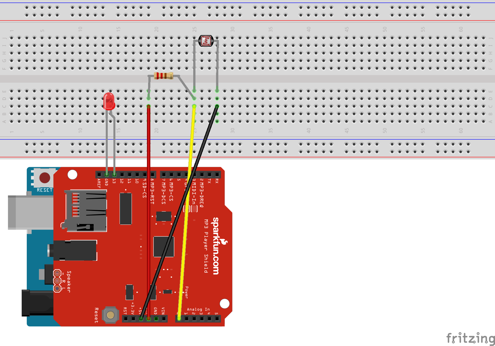

# SparkFun MP3 with light Sensor |  Livro Sonoro 

Este projeto faz parte da  construção de uma obra de arte sonora desenvolvida por mim e idealizada por Floriano Romano. Por isso adicionei o máximo de comentários no código para que o mesmo pode-se entender o que acontecia e lembrar-se para poder explicar suas particularidades. 
A ideia é esconder o LDR entre as páginas do livro para quando uma pessoa abrir o livro ter a experiência  de ouvir um som ao passar das páginas. Tendo assim duas versões uma com apenas uma página e outra com diversas páginas. Lembre-se de levar em consideração a gramatura do papel e a quantidade de luz no ambiente. 

> Desenvolvedor: **Fábio R. Nóbrega**
> 
> Artista: **Floriano Romano**

### Modo de Usar 

#### Para rodar esse código em seu arduino é necessário: 
+ SparkFun MPR Shield 
+ Um LED (para debug) 
+ Arduino Uno 
+ 1 LDR 5mm Fotoresistor P/ Pic Arduino Sensor De Luz
+ Adicionar biblioteca FEMP3Shield.h e SdFat.h no seu Arduino que estão nesse repositório qualquer dúvida siga a [documentação oficial do arduino](https://www.arduino.cc/en/guide/libraries#) 

#### Setup 

+ Adicionar FEMP3Shield.h e SdFat.h em  `arduino/libraries`
+ Adicionar pastas `LIVRO_SONORO_UMA_PAGINAS` e `LIVRO_SONORO_DUAS_PAGINAS` em `arduino/examples` dentro de uma pasta a sua escolha: ex:. `12.Light_Sensor_with_MPR3_Shield`
+ Ao abrir  IDE Arduino o código estará disponível em `File > Examples / 12.Light_Sensor_with_MPR3_Shield`
+ Uma vez a parte de software organizada siga o esquema de arduino abaixo para a parte de hardware. 

### Como Funciona? 

O princípio desse projeto é usar a intensidade de luz que atravessa uma folha de papel. E com isso emitir diferentes sons dependendo de que página você esta. Com isso a [gramatura do papel](https://pt.wikipedia.org/wiki/Gramatura) é uma variável fundamental nesse projeto.

> Fique livre para interagir com o código e descobrir novas formas de arte. 

##### Boa arte 👋

